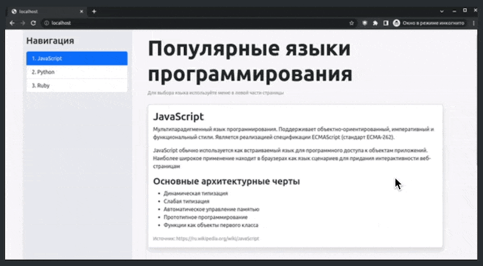

The project uses Bootstrap's List Group to implement tab switching.

## Example

## src/application.js

The active list group gets the `active` class. The content corresponding to the active list group gets the `active show` classes.

The project can work with any number of list groups on a page.